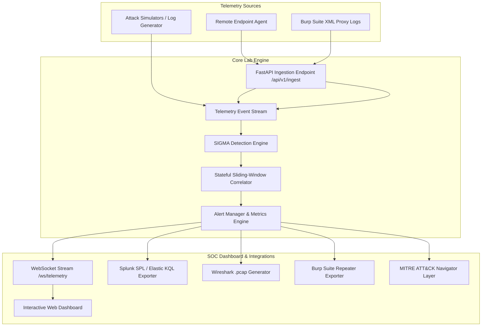

# 🛡️ SOC Telemetry & Threat Detection Lab

[](https://www.python.org/)
[](https://fastapi.tiangolo.com/)
[](https://github.com/SigmaHQ/sigma)
[](https://attack.mitre.org/)
[](LICENSE)

A production-grade **Security Operations Center (SOC) Telemetry & Threat Detection Lab**. This platform simulates enterprise multi-stage cyber attacks, ingests real-time host and web telemetry, evaluates event streams against **SIGMA detection rules**, correlates stateful temporal windows, exports queries to **Splunk SPL** and **Elastic KQL**, and features deep integration with **Wireshark** (`.pcap`), **Burp Suite**, and **MITRE ATT&CK Navigator**.

---

## 🌟 Key Features

* **⚡ Real-Time SIGMA Detection Engine**: Evaluates live telemetry against single-event and sliding-window stateful correlation rules written in standard YAML.
* **🎯 10+ Multi-Stage Attack Simulators**: Triggers realistic cyber attack scenarios (LSASS dumping, Kerberoasting, SUID privilege escalation, reverse shell spawns, DNS tunneling, driver tampering).
* **🖥️ Interactive SOC Web Dashboard**: Real-time WebSocket-powered dashboard for event monitoring, alert triage, rule tuning, and live SOC KPI metrics tracking (**Precision %, Recall %, FPR %, MTTD**).
* **🔄 SIEM Query Exporters**: Automatically translates SIGMA rules into **Splunk SPL** and **Elastic KQL** queries on the fly.
* **🌐 MITRE ATT&CK Navigator Export**: Generates dynamic JSON layer files mapped to tactics and techniques for MITRE ATT&CK Navigator visualization.
* **🦈 Wireshark & Burp Suite Integrations**:
  * **Wireshark**: Generates raw `.pcap` capture files on-demand for specific alert triage and provides custom Wireshark display filters.
  * **Burp Suite**: Ingests Burp Suite XML proxy logs and exports raw HTTP requests with formatted `cURL` commands for offensive verification.
* **📡 Remote Endpoint Collector Agent**: Ingests remote telemetry via high-throughput HTTP batch ingestion (`/api/v1/ingest`) with live agent heartbeat tracking.
* **📄 Forensic Incident Reporter**: Generates formal, audit-ready SOC Incident Analysis Reports in JSON/Markdown format for triggered alerts.

---

## 🏗️ Architecture & Data Flow



---

## 🚀 Quickstart Guide

### Option 1: One-Command Launcher (Local Python)

Clone the repository, install requirements, and run the quickstart script:

```bash
# Clone the repository
git clone https://github.com/hemuh877-del/soc-telemetry-detection-lab.git
cd soc-telemetry-detection-lab

# Run the automated quickstart script
python setup_and_run.py
```
> **Note**: `setup_and_run.py` automatically verifies Python dependencies, launches the FastAPI/Uvicorn server at `http://127.0.0.1:8000`, and opens the dashboard in your default browser.

### Option 2: Manual Setup

```bash
# Create and activate virtual environment
python -m venv .venv
source .venv/bin/activate  # On Windows: .venv\Scripts\activate

# Install dependencies
pip install -r requirements.txt

# Start the detection engine & web server
python web/server.py
```

### Option 3: Docker Deployment

```bash
# Run with Docker Compose
docker-compose up --build
```
Access the dashboard at `http://localhost:8000`.

---

## 🎯 Attack Scenarios & Detection Coverage

| Scenario | MITRE ATT&CK | Description | Detection Rule |
| :--- | :--- | :--- | :--- |
| **Anomalous Shell Spawn** | `T1059.004` | Reverse shell spawned from web server process (`nginx` / `apache2`) | `RULE-003` |
| **LSASS Memory Dump** | `T1003.001` | Credential dumping via process access to `lsass.exe` | `RULE-001` |
| **SUID Privilege Escalation** | `T1548.001` | Binary elevation using misconfigured SUID bits | `RULE-002` |
| **Kerberoasting (TGS Request)** | `T1558.003` | Excessive RC4 Ticket Granting Service requests | `RULE-004` |
| **DNS Tunnel Exfiltration** | `T1071.004` | High-frequency encoded DNS queries to C2 domain | `RULE-005` |
| **Kernel Driver Tampering** | `T1068` | Vulnerable kernel driver load attempt for BYOVD attacks | `RULE-006` |
| **Crontab Persistence** | `T1053.003` | Malicious cron entry addition for persistence | `RULE-007` |
| **Process Hollowing** | `T1055.012` | Unbacked memory execution and process injection | `RULE-008` |
| **SSH Brute Force** | `T1110.001` | Sliding-window threshold correlation of failed SSH logins | `RULE-009` |
| **WinRM Lateral Movement** | `T1021.006` | Remote powershell session creation across hosts | `RULE-010` |

---

## 📊 SOC Metrics & Triage Workflow

The lab tracks real-time SOC effectiveness metrics based on analyst triage actions:

$$\text{Precision} = \frac{\text{True Positives}}{\text{True Positives} + \text{False Positives}} \times 100\%$$

$$\text{Recall} = \frac{\text{True Positives}}{\text{True Positives} + \text{False Negatives}} \times 100\%$$

* **Analyst Triage States**: `NEW` ➔ `INVESTIGATING` ➔ `ESCALATED` / `CLOSED`
* **One-Click Rule Tuning**: Tuning an alert automatically adjusts rule parameters to suppress false positives and preserves detection accuracy.

---

## 📡 REST API Reference

The FastAPI backend exposes endpoints for integration, automation, and forensic exports:

| Endpoint | Method | Description |
| :--- | :--- | :--- |
| `GET /` | `GET` | Interactive SOC Dashboard UI |
| `POST /api/simulate` | `POST` | Trigger attack simulation scenarios |
| `GET /api/telemetry` | `GET` | Fetch recent log telemetry stream |
| `GET /api/alerts` | `GET` | Fetch generated detection alerts |
| `POST /api/alerts/{alert_id}/triage` | `POST` | Update alert status (`INVESTIGATING`, `CLOSED`, etc.) |
| `POST /api/alerts/{alert_id}/tune` | `POST` | Tune detection rule for an alert |
| `GET /api/metrics` | `GET` | Get live SOC KPIs (Precision, Recall, MTTD) |
| `GET /api/rules/{rule_id}/export` | `GET` | Export SIGMA rule to **Splunk SPL** & **Elastic KQL** |
| `GET /api/mitre/navigator` | `GET` | Download MITRE ATT&CK Navigator Layer JSON |
| `POST /api/v1/ingest` | `POST` | Ingest telemetry batch from remote agents |
| `GET /api/v1/pcap/export/{alert_id}` | `GET` | Download Wireshark binary `.pcap` capture file |
| `GET /api/v1/burp/export/{alert_id}` | `GET` | Export Burp Suite Repeater request & cURL command |
| `POST /api/v1/burp/ingest` | `POST` | Ingest Burp Suite XML proxy logs |
| `GET /api/v1/alerts/{alert_id}/report` | `GET` | Generate formal Forensic Incident Report |

---

## 📁 Repository Structure

```
.
├── agent/                  # Endpoint Collector Agent (remote telemetry ingestion)
│   └── collector.py
├── engine/                 # Core Detection & Analytics Engine
│   ├── alert_manager.py    # Alert lifecycle, state tracking, and tuning
│   ├── burp_integrator.py # Burp Suite XML parser & HTTP exporter
│   ├── detection_engine.py # Main SIGMA event matching & window correlation
│   ├── exporter.py         # Splunk SPL, Elastic KQL, & MITRE Navigator exporters
│   ├── metrics.py          # Real-time SOC metric calculation engine
│   ├── pcap_analyzer.py    # Wireshark .pcap generator & filter exporter
│   └── rule_parser.py     # SIGMA YAML rule parser
├── generator/              # Attack Simulation & Telemetry Generator
│   ├── attack_simulators.py# Scenario-based payload generators
│   ├── log_generator.py   # Background telemetry generator
│   └── models.py          # Pydantic data models & enums
├── rules/                  # SIGMA Detection Rules (YAML format)
├── docs/                   # Incident Case Studies & Forensic Guides
│   └── INCIDENT_CASE_STUDY.md
├── web/                    # SOC Web Application (FastAPI + Vanilla JS/CSS)
│   ├── css/
│   ├── js/
│   ├── index.html
│   └── server.py
├── Dockerfile              # Production Container Dockerfile
├── docker-compose.yml      # Orchestration config
├── requirements.txt        # Python package dependencies
└── setup_and_run.py        # One-command quickstart script
```

---

## 📜 License

This project is licensed under the **MIT License** - see the [LICENSE](LICENSE) file for details.
