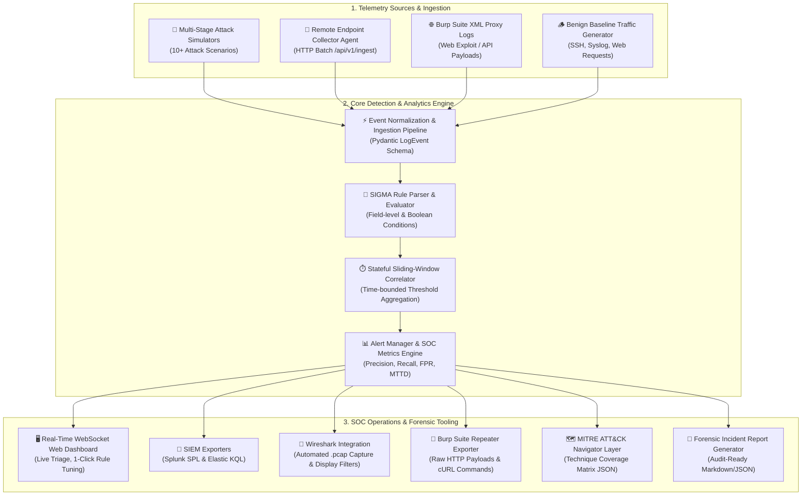

# 🛡️ SOC Telemetry & Threat Detection Lab

[](https://www.python.org/)
[](https://fastapi.tiangolo.com/)
[](https://github.com/SigmaHQ/sigma)
[](https://attack.mitre.org/)
[](LICENSE)

> **A real-time SOC detection engineering lab that ingests live host and web telemetry, identifies multi-stage cyber attacks using SIGMA rules and stateful temporal windows, and empowers analysts with instant alert triage, SIEM query translation (Splunk SPL / Elastic KQL), and forensic packet exports.**

---

## 🏗️ Architecture & Data Flow



---

## 🎯 What It Detects

The lab provides end-to-end detection coverage for 11 realistic attack scenarios mapped directly to **MITRE ATT&CK tactics and techniques**:

### 🔑 Credential Access & Authentication Abuse
* **LSASS Memory Dumping (`T1003.001` | `RULE-011`)**: Detects unauthorized access to `lsass.exe` process memory initiated via `rundll32.exe`, `comsvcs.dll MiniDump`, or memory dumping utilities to extract plaintext credentials and NTLM hashes.
* **Kerberoasting via TGS Request (`T1558.003` | `RULE-010`)**: Identifies anomalous Active Directory Kerberos Ticket Granting Service (TGS) requests querying Service Principal Names (SPNs) with downgrade-prone RC4-HMAC (`0x17`) encryption for offline cracking.
* **SSH Credential Brute Force (`T1110.001` | `RULE-001`)**: Correlates multiple consecutive failed SSH authentication attempts across a stateful sliding temporal window (e.g., $\ge 5$ failures in 30 seconds) grouped by source IP.

### 🛡️ Privilege Escalation & Defense Evasion
* **SUID Binary Abuse & Privilege Escalation (`T1548.001` | `RULE-002`)**: Detects setuid permission modifications (`chmod u+s`), unauthorized sudo abuse, and execution of shells resulting in effective root privileges (`uid=0`).
* **Process Hollowing & Memory Injection (`T1055.012` | `RULE-008`)**: Catches stealthy code injection techniques where legitimate system processes (e.g., `svchost.exe`) are spawned from abnormal paths with unbacked memory sections and `NtUnmapViewOfSection` execution.
* **Security Audit Log Deletion & Tampering (`T1070.002` | `RULE-007`)**: Flags malicious attempts to wipe, unlink, or suppress critical host audit trails (such as `/var/log/auth.log`, `/var/log/syslog`, or `wevtutil` log clearing).
* **BYOVD Kernel Driver Tampering (`T1068` | `RULE-009`)**: Detects "Bring Your Own Vulnerable Driver" attacks where known vulnerable signed kernel drivers (e.g., `RTCore64.sys`) are loaded to blind endpoint security sensors and modify kernel callbacks.

### ⚡ Execution, Persistence & Lateral Movement
* **Webshell & Anomalous Shell Spawn (`T1059.004` | `RULE-003`)**: Flags web server daemon processes (`nginx`, `apache2`, `www-data`) spawning interactive shells (`/bin/sh`, `bash`) or outbound network utilities (`nc`, `netcat`) indicative of reverse shells.
* **Crontab Persistence Modification (`T1053.003` | `RULE-004`)**: Identifies unauthorized additions and modifications to scheduled cron jobs (`crontab -e`) pointing to external staging scripts or reverse connections.
* **WinRM & Remote Execution Lateral Movement (`T1021.006` | `RULE-005`)**: Intercepts lateral network hops and remote PowerShell execution via Windows Remote Management (`wsmprovhost.exe`, `psexec`) across internal endpoints.

### 📡 Command & Control and Exfiltration
* **DNS Tunneling & Covert Exfiltration (`T1071.004` | `RULE-006`)**: Identifies high-frequency encoded DNS TXT/NULL record queries directed at attacker-controlled authoritative name servers to bypass standard perimeter egress controls.

---

## 💡 What I Learned

Building this SOC detection and telemetry lab provided deep, hands-on engineering takeaways across the detection lifecycle:

* **Stateful Correlation vs. Stateless Matching**: Single-event signature matching fails against distributed attacks like brute-force or low-and-slow reconnaissance. Implementing a sliding-window correlation engine highlighted how temporal aggregation, time-decay buffers, and entity grouping (by IP, User, or Host) are essential to catch multi-stage attacks without memory leaks.
* **The Precision vs. Recall Tradeoff in SOC Operations**: High detection sensitivity often results in alert fatigue and false positives, eroding analyst trust. Designing interactive **one-click rule tuning** taught how threshold adjustments and conditional whitelisting directly impact SOC KPIs (Precision %, Recall %, FPR %, and MTTD).
* **Telemetry Normalization is Foundational**: Real enterprise telemetry arrives in fragmented formats (Linux `auditd` syscall records, Syslog streams, Nginx access logs, and Burp Suite XML). Enforcing strict Pydantic event modeling and canonical field schemas allowed universal SIGMA rules to evaluate cleanly across diverse log sources.
* **Vendor-Agnostic Detection as Code**: Writing detections in standard YAML and building automated transpilers to **Splunk SPL** and **Elastic KQL** proved how modular detection engineering decouples detection logic from proprietary SIEM query lock-in.
* **Accelerating Analyst Triage with Contextual Forensics**: Detection alerts are only as good as the context delivered with them. Equipping alerts with instant **Wireshark `.pcap` generation**, **Burp Repeater exports**, and **MITRE ATT&CK Navigator matrices** showed how contextual tooling dramatically reduces Mean Time to Triage and Respond (MTTR).

---

## 🌟 Key Features

* **⚡ Real-Time SIGMA Detection Engine**: Evaluates live telemetry against single-event and sliding-window stateful correlation rules in standard YAML.
* **🎯 10+ Scenario Attack Simulators**: Triggers realistic cyber attack scenarios with a single click or API call.
* **🖥️ Interactive SOC Web Dashboard**: Modern dark-themed dashboard powered by real-time WebSockets with live event feeds, alert queues, and SOC metrics tracking (**Precision %, Recall %, FPR %, MTTD**).
* **🔄 Dual-SIEM Query Exporters**: Converts any active SIGMA rule into **Splunk SPL** and **Elastic KQL** queries instantly.
* **🌐 MITRE ATT&CK Navigator Integration**: Dynamically exports technique layer JSON files for visualization in the official MITRE ATT&CK Navigator.
* **🦈 Wireshark & Burp Suite Integrations**:
  * **Wireshark**: Generates raw, downloadable `.pcap` packet capture files on-demand with pre-built display filters.
  * **Burp Suite**: Ingests Burp Suite XML proxy logs and exports raw HTTP payloads with formatted `cURL` commands for offensive verification.
* **📡 Remote Endpoint Collector Agent**: Ingests remote telemetry batches over HTTP (`/api/v1/ingest`) with live agent heartbeat tracking.
* **📄 Forensic Incident Reporter**: Generates audit-ready SOC Incident Analysis Reports in JSON and Markdown formats.

---

## 🚀 Quickstart Guide

### Option 1: Automated Launcher (Recommended)

Clone the repository and run the automated quickstart script:

```bash
# Clone the repository
git clone https://github.com/hemuh877-del/soc-telemetry-detection-lab.git
cd soc-telemetry-detection-lab

# Run automated setup & launcher
python setup_and_run.py
```
> `setup_and_run.py` verifies dependencies, initializes the FastAPI/Uvicorn server at `http://127.0.0.1:8000`, and opens the dashboard in your default browser automatically.

### Option 2: Live Endpoint Telemetry Bridge (CLI Forwarder)

Stream your local computer's real-time processes, sockets, and hardware specs directly to the SOC Detection Engine:

```bash
# Start live telemetry bridge (auto-connects or auto-starts local engine)
python bridge.py

# Or stream live telemetry to a remote/cloud SOC deployment:
python bridge.py --server https://your-soc-deployment.vercel.app

# Check server health & active devices inventory:
python bridge.py --status

# Trigger an attack simulation directly from the CLI:
python bridge.py --simulate brute_force
```

### Option 3: Manual Setup

```bash
# Create and activate virtual environment
python -m venv .venv
# On Windows:
.venv\Scripts\activate
# On Linux/macOS:
source .venv/bin/activate

# Install dependencies
pip install -r requirements.txt

# Start the detection engine and web server
python web/server.py
```

### Option 4: Docker Deployment

```bash
# Build and run with Docker Compose
docker-compose up --build
```
Access the dashboard at `http://localhost:8000`.

---

## 📊 SOC Metrics & Triage Workflow

The lab tracks real-time SOC operational metrics based on analyst triage actions:

$$\text{Precision} = \frac{\text{True Positives}}{\text{True Positives} + \text{False Positives}} \times 100\%$$

$$\text{Recall} = \frac{\text{True Positives}}{\text{True Positives} + \text{False Negatives}} \times 100\%$$

* **Analyst Triage States**: `NEW` ➔ `INVESTIGATING` ➔ `ESCALATED` / `CLOSED`
* **One-Click Rule Tuning**: Automatically updates rule thresholds and conditions to suppress false positives while maintaining high recall.

---

## 📡 REST API Reference

| Endpoint | Method | Description |
| :--- | :--- | :--- |
| `GET /` | `GET` | Interactive SOC Dashboard UI |
| `POST /api/simulate` | `POST` | Trigger specific attack simulation scenarios |
| `GET /api/telemetry` | `GET` | Fetch recent normalized telemetry stream |
| `GET /api/alerts` | `GET` | Fetch generated detection alerts |
| `POST /api/alerts/{alert_id}/triage` | `POST` | Update alert triage state (`INVESTIGATING`, `CLOSED`, etc.) |
| `POST /api/alerts/{alert_id}/tune` | `POST` | Tune detection rule parameters for an alert |
| `GET /api/metrics` | `GET` | Retrieve live SOC KPIs (Precision, Recall, FPR, MTTD) |
| `GET /api/rules/{rule_id}/export` | `GET` | Export SIGMA rule to **Splunk SPL** & **Elastic KQL** |
| `GET /api/mitre/navigator` | `GET` | Download MITRE ATT&CK Navigator Layer JSON |
| `GET /api/v1/devices` | `GET` | List all actively monitored endpoints and user client devices |
| `POST /api/v1/client-device/register` | `POST` | Register a connected browser endpoint with hardware specifications |
| `POST /api/v1/client-device/telemetry` | `POST` | Ingest real-time continuous browser client telemetry |
| `POST /api/v1/ingest` | `POST` | Ingest telemetry batch from remote endpoint agents |
| `GET /api/v1/agent/status` | `GET` | Query agent heartbeat status and total ingested telemetry counts |
| `GET /api/v1/pcap/export/{alert_id}` | `GET` | Download synthesized Wireshark binary `.pcap` file |
| `GET /api/v1/burp/export/{alert_id}` | `GET` | Export Burp Suite Repeater request & cURL command |
| `POST /api/v1/burp/ingest` | `POST` | Ingest Burp Suite XML proxy logs |
| `GET /api/v1/alerts/{alert_id}/report` | `GET` | Generate formal Forensic Incident Report |

---

## 📁 Repository Structure

```
.
├── bridge.py               # Universal Live Endpoint Telemetry Bridge & CLI Forwarder
├── setup_and_run.py        # One-Command Quickstart Launcher
├── agent/                  # Endpoint Collector Agent (remote telemetry ingestion)
│   └── collector.py
├── engine/                 # Core Detection & Analytics Engine
│   ├── alert_manager.py    # Alert lifecycle, state tracking, and tuning
│   ├── burp_integrator.py # Burp Suite XML parser & HTTP exporter
│   ├── detection_engine.py # Main SIGMA event matching & window correlation
│   ├── exporter.py         # Splunk SPL, Elastic KQL, & MITRE Navigator exporters
│   ├── metrics.py          # Real-time SOC metric calculation engine
│   ├── pcap_analyzer.py    # Wireshark .pcap generator & filter exporter
│   └── rule_parser.py     # SIGMA YAML rule parser
├── generator/              # Attack Simulation & Telemetry Generator
│   ├── attack_simulators.py# Scenario-based payload generators
│   ├── log_generator.py   # Background telemetry generator
│   └── models.py          # Pydantic data models & enums
├── rules/                  # SIGMA Detection Rules (YAML format)
├── docs/                   # Incident Case Studies & Forensic Guides
│   └── INCIDENT_CASE_STUDY.md
├── tests/                  # Automated Test Suite (24 test cases)
├── web/                    # SOC Web Application (FastAPI + WebSocket UI)
├── Dockerfile              # Container Dockerfile
├── docker-compose.yml      # Container Orchestration
├── requirements.txt        # Python Dependencies
└── pyproject.toml          # Project Metadata & Packaging
```

---

## 📜 License

This project is licensed under the **MIT License** - see the [LICENSE](LICENSE) file for details.

